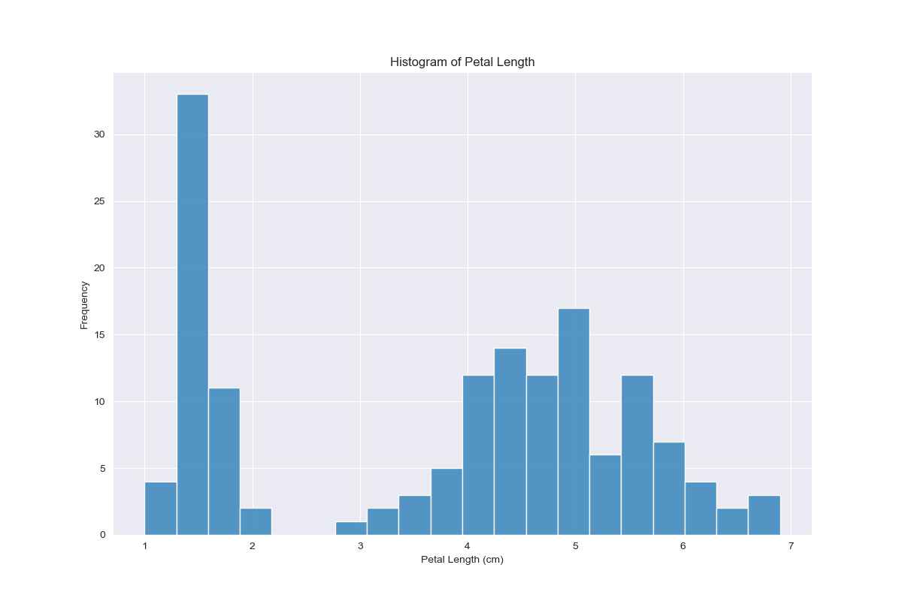
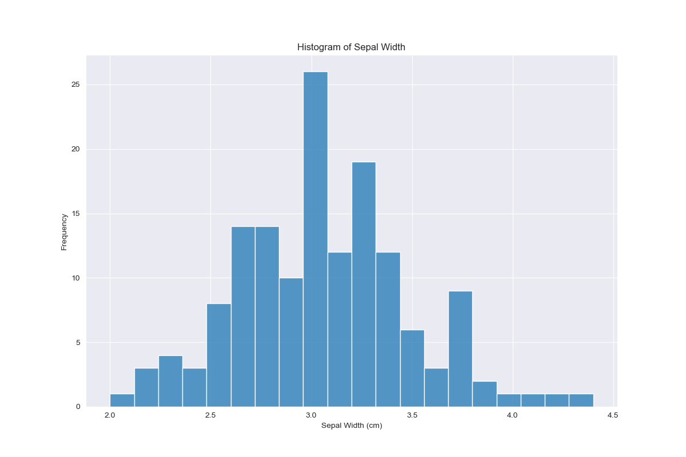
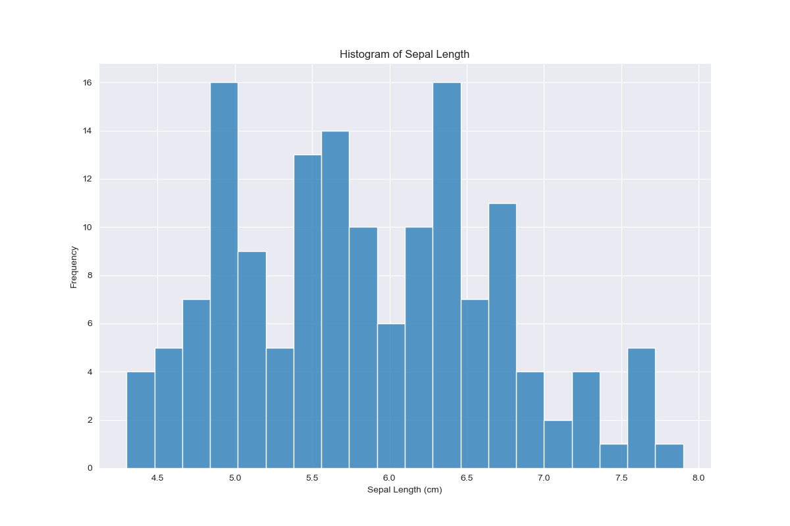

# pands-project

### Installation instructions:

Clone the repository and change directory into it.

`git clone git@github.com:Cking313/pands-project.git && cd pands-project`

Install the requirements using the supplied requirements.txt file:

`pip install -r requirements.txt`

### Data Summary

Figure 1 - Images of the three Iris species, annotated to demonstrate the difference between petal and sepal

_Retrieved from https://s3.amazonaws.com/assets.datacamp.com/blog_assets/Machine+Learning+R/iris-machinelearning.png_

There are 150 data points across 5 columns
4 of the columns are numeric and one is categorical
The 4 numeric columns are ....
sepal_length has a mean value of 5.84, and its values range from a minimum of 4.3 to a maximum of 7.9

petal_length has the largest spread in values, as its standard deviation is 1.76, whereas the other numeric columns have standard deviations less than 1 - we would expect to see a wider histogram for petal length than the other numeric features.

The observations are evenly distributed between the species, with 50 observations of each of iris setosa, versicolor, and virginica.

### Histograms

There are many observations of very narrow petals, and otherwise a spread of values between 1 and 2.5 cm. The large number of narrow petals may be due to the iris setosa observations, as this species has a significantly narrower petal on average than the other two species.

Petal length is similarly distributed, with two groups of values - one small narrowly distributed and one larger, wider group.

Sepal width appears to be relatively normally distributed compared to the petal measurements, with values centered around 3cm.

Again, there is less of an obvious separation between groups for sepal length, however the values are not as centered around a single value as with sepal width, with a semeingly even spread of values between around 4.5 and 7cm.