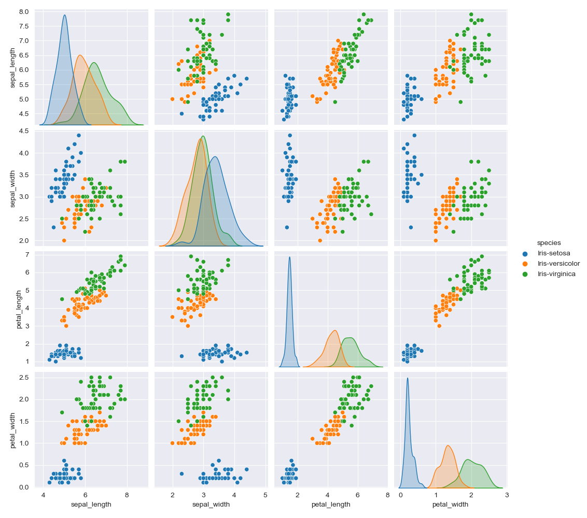
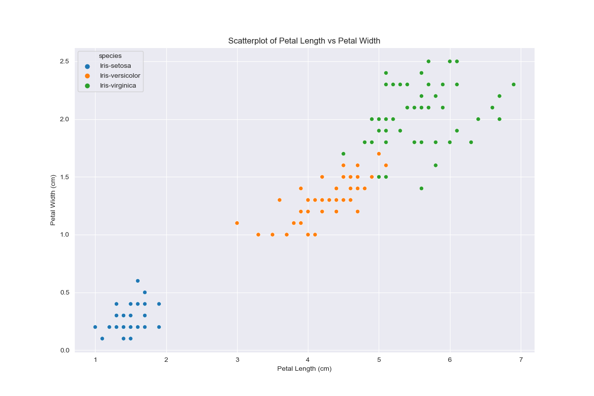
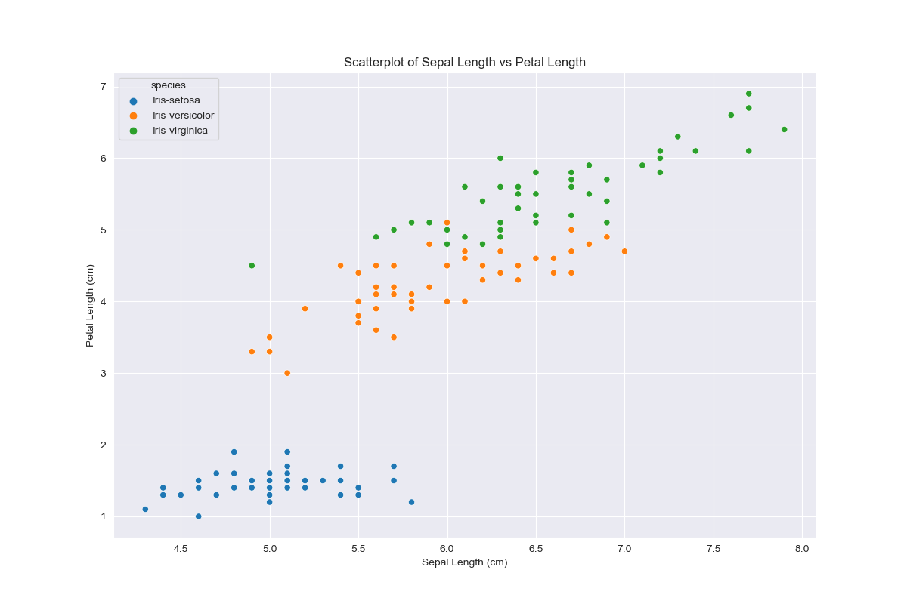
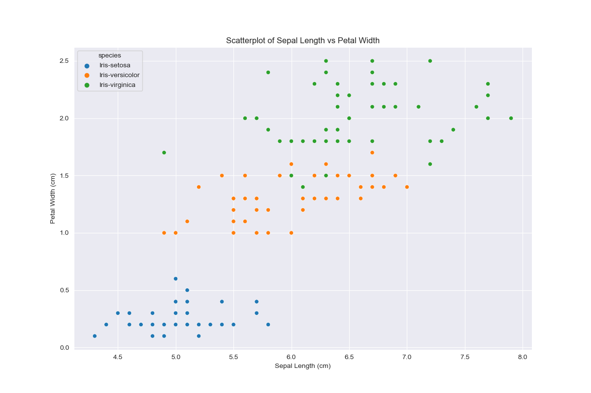
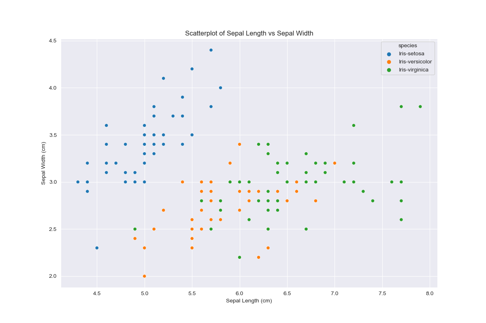
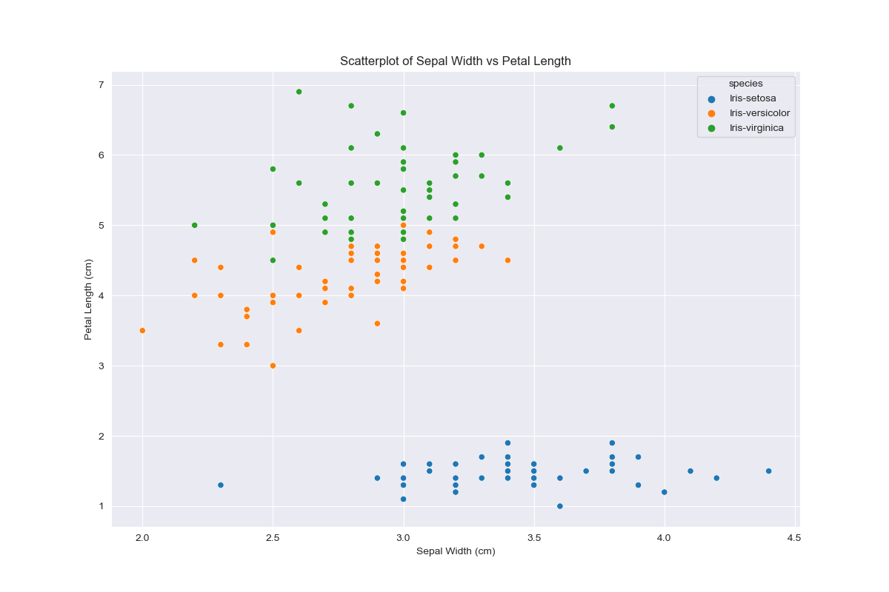
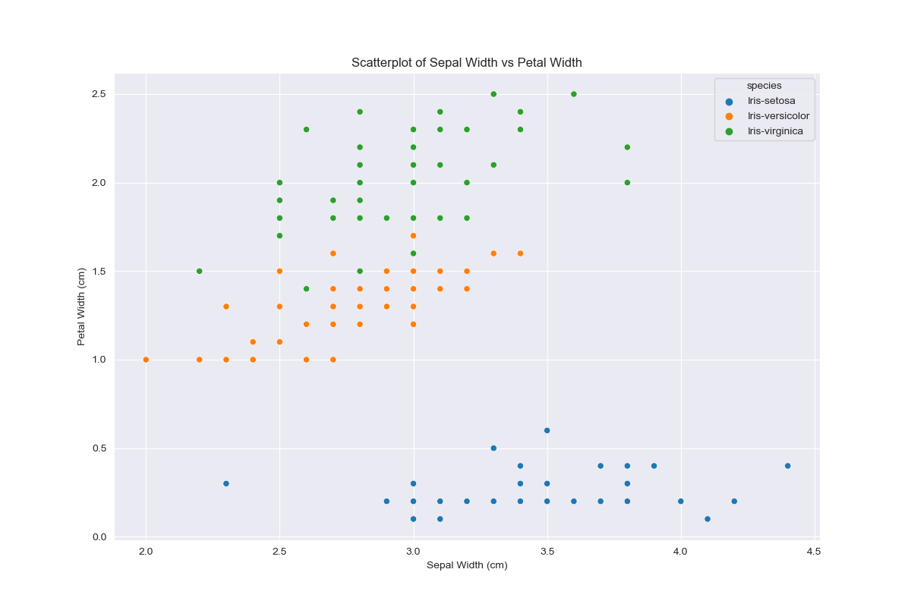

# pands-project

### Installation instructions:

Clone the repository and change directory into it.

`git clone git@github.com:Cking313/pands-project.git && cd pands-project`

Install the requirements using the supplied requirements.txt file:

`pip install -r requirements.txt`

The code can then be run:
`python ./analysis.py`

This will:

- Download the Iris dataset and save it to a .csv file
- Generate a numeric summary fo the data using pandas, and write this to a .md file as a markdown table
- Create a folder called "charts/" if one does not exist already
- Generate a histogram of each of the numeric features in the iris dataset and save these to charts/
- Generate a pairplot for the dataset and save this to charts/
- Generate a scatterplot for each pair of numeric variables and save these to charts/

The created charts are referenced in this README file, so once the analysis.py file has been run the local filepaths will resolve properly.

### Data Summary

Figure 1 - Images of the three Iris species, annotated to demonstrate the difference between petal and sepal

_Retrieved from https://s3.amazonaws.com/assets.datacamp.com/blog_assets/Machine+Learning+R/iris-machinelearning.png_

A numerical description of the data produced by pandas can be found below, including summary statistics.

|        |   sepal_length |   sepal_width |   petal_length |   petal_width | species     |
|:-------|---------------:|--------------:|---------------:|--------------:|:------------|
| count  |     150        |    150        |      150       |    150        | 150         |
| unique |     nan        |    nan        |      nan       |    nan        | 3           |
| top    |     nan        |    nan        |      nan       |    nan        | Iris-setosa |
| freq   |     nan        |    nan        |      nan       |    nan        | 50          |
| mean   |       5.84333  |      3.054    |        3.75867 |      1.19867  | nan         |
| std    |       0.828066 |      0.433594 |        1.76442 |      0.763161 | nan         |
| min    |       4.3      |      2        |        1       |      0.1      | nan         |
| 25%    |       5.1      |      2.8      |        1.6     |      0.3      | nan         |
| 50%    |       5.8      |      3        |        4.35    |      1.3      | nan         |
| 75%    |       6.4      |      3.3      |        5.1     |      1.8      | nan         |
| max    |       7.9      |      4.4      |        6.9     |      2.5      | nan         |

There are 150 data points across 5 columns
4 of the columns are numeric and one is categorical
The 4 numeric columns are ....
sepal_length has a mean value of 5.84, and its values range from a minimum of 4.3 to a maximum of 7.9

petal_length has the largest spread in values, as its standard deviation is 1.76, whereas the other numeric columns have standard deviations less than 1 - we would expect to see a wider histogram for petal length than the other numeric features.

The observations are evenly distributed between the species, with 50 observations of each of iris setosa, versicolor, and virginica.

### Histograms

There are many observations of very narrow petals, and otherwise a spread of values between 1 and 2.5 cm. The large number of narrow petals may be due to the iris setosa observations, as this species has a significantly narrower petal on average than the other two species.

Petal length is similarly distributed, with two groups of values - one small narrowly distributed and one larger, wider group.

Sepal width appears to be relatively normally distributed compared to the petal measurements, with values centered around 3cm.

Again, there is less of an obvious separation between groups for sepal length, however the values are not as centered around a single value as with sepal width, with a semeingly even spread of values between around 4.5 and 7cm.

Looking at the pairplot, which includes density plots separated by colour per species of iris, we can see that iris setosa has a separate distribution of values for petal length and width which are typically much smaller than those of the other two species. This influenced our histograms earlier, as the data for all three species was mixed in together.

We can see from the scatterplots that while iris virginica and versicolor have separable clusters of values, their values for most pairs of variables are close together, whereas iris setosa's value clusters are quite far away from the values of the other two species.

Individual charts for each variable pair coloured by species can be found below:

### References

- https://stackoverflow.com/questions/32400867/pandas-read-csv-from-url
- https://pandas.pydata.org/docs/reference/api/pandas.DataFrame.describe.html
- https://pandas.pydata.org/docs/reference/api/pandas.DataFrame.to_markdown.html
- https://www.geeksforgeeks.org/python-check-if-a-file-or-directory-exists/
- https://python-charts.com/seaborn/themes/
- https://seaborn.pydata.org/generated/seaborn.scatterplot.html
- https://seaborn.pydata.org/generated/seaborn.histplot.html
- https://seaborn.pydata.org/generated/seaborn.pairplot.html
- https://docs.python.org/3/library/itertools.html#itertools.combinations
- https://blog.teclado.com/destructuring-in-python/
